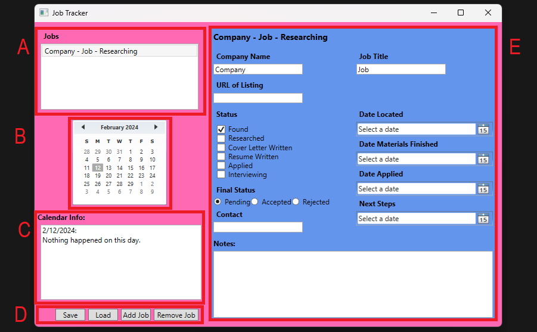

# The Job Tracker

The job tracker can be used to track the current status of many different job applications at a glance. This application was created with the purpose of learning the basics of WPF.

**Table of Contents**
- [UI Explination](#ui-explination)
- [How To](#how-to)
- [Next Features](#next-features)

## UI Explination

A. This list shows all the jobs you have added into the program and allows to you to select them to show their information.

B. This calendar highlights dates where changes were made to the job being tracked. This allows the user to see at a glance what days they worked on their job hunt. Clicking on a day shows information about what happened in the Calendar Info section (Section C).

C. The calendar info section provides information on what progress was made in the job hunt on the given date.

D. These buttons allow you to Save your current data as an XML file, Load previous data from an XML file, Add a new job, or remove the currently selected job.
## How To
### Add a New Job

1. Click the Add Job Button in section D
2. Congrats, you now have a new Job

### Remove an Existing Job

1. Click the Remove Job button in section D
2. You will be asked to confirm your choice, this action can not be undone.
3. Congrats you have removed a job.

NOTE: You can not remove your last job.